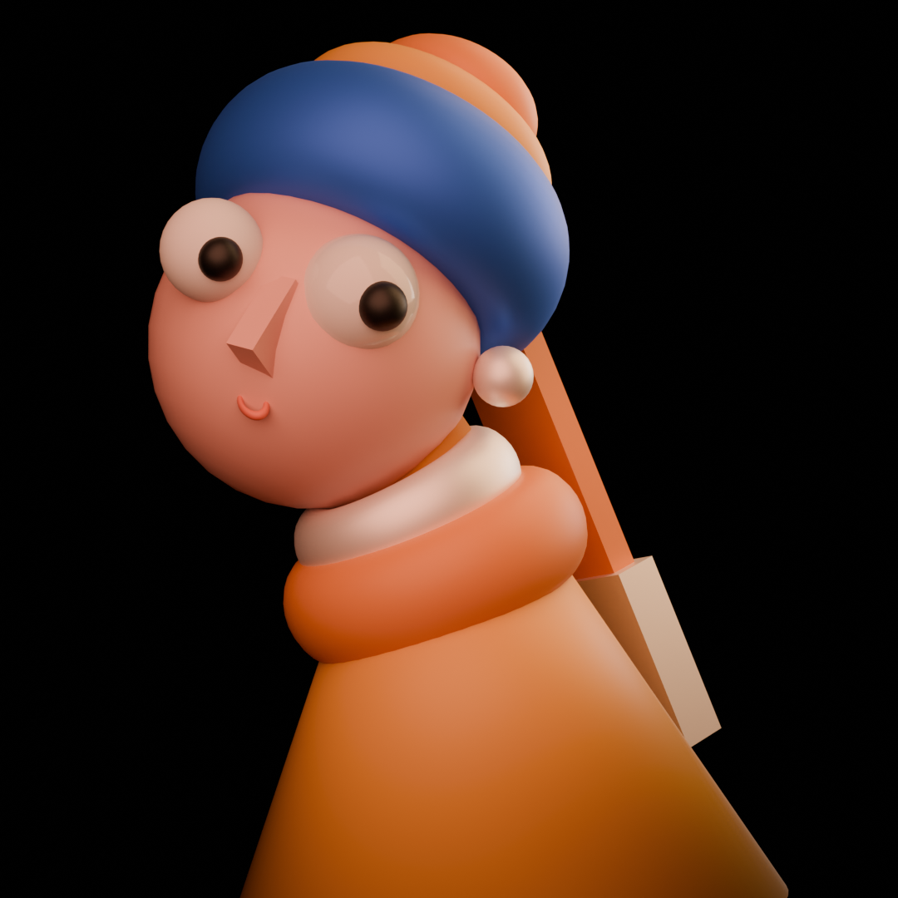

##  Project Overview
This is my very first Blender project, inspired by the painting **"Girl with a Pearl Earring"** 

The goal of this project was to recreate the essence of the artwork in 3D form while learning the basics of Blender.

##  What I Learned
I explored the core fundamentals of Blender:

- **Modelling:** Basic shape creation and sculpting
- **Lighting:** Adjusted the direction of lights and chose appropriate light types
- **Texturing:** Applied materials and simple shaders
- **Rendering:** Set up the camera, adjusted render settings, and rendered the final scene using Cycles 

##  Output

The image above showcases the final render from this project

